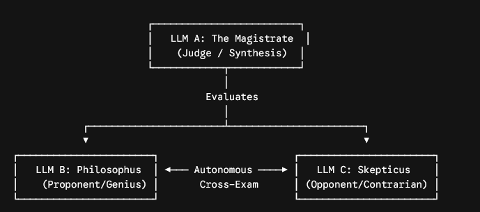

# Large Language Models - Conversing through Debates

## Abstract

Multi-Agent Debate (MAD) was formally introduced in peer-reviewed research (arXiv:2305.14325) by Yilun Du et al. as a framework to reduce hallucinations and overcome Degeneration-of-Thought in Large Language Models (LLMs). While conventional MAD setups rely on direct iterative counter-arguments, they often suffer from topic drift, sycophantic convergence, or superficial disagreements. To address these limitations, this paper introduces the "Roman Forum" architecture. 3 agent dialectic system that incorporates autonomous, self-directed cross-examination. In this model, an affirmative agent ("Philosophus") and an adversarial agent ("Skepticus") do not merely respond to statements, but autonomously generate probing sub-questions to interrogate core premises and surface hidden failure modes. A neutral magistrate agent ("Praetor") enforces procedural constraints, evaluates logical fallacies, and synthesizes the final decree.

